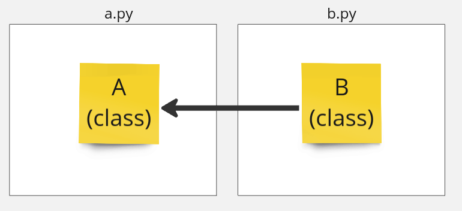
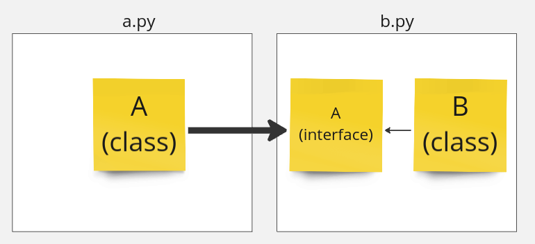

# Инверсия зависимости 

Под зависимостью понимается буквально зависимость на уровне исходного кода. Если модуль `b.py` напрямую или транзитивно импортирует модуль `a.py`, то говорится, что `b.py` зависит от `a.py`.



```python
"""
File: a.py
"""

class A:
    def method(self) -> None:
        ...
```

```python
"""
File: b.py
"""

# noinspection PyUnresolvedReferences,PyPackageRequirements
from a import A  # `b.py` depends on `a.py`

class B:
    def __init__(self) -> None:
        self.a = A()
```

Такую зависимость можно инвертировать, определив интерфейс и поместив его в модуль `b.py`.




```python
"""
File: a.py
"""
# noinspection PyUnresolvedReferences,PyPackageRequirements
import b # `a.py` depends on `b.py`

class A(b.A):
    def method(self) -> None:
        ...
```

```python
"""
File: b.py
"""
from abc import ABC, abstractmethod

class A(ABC):
    @abstractmethod
    def method(self) -> None:
        pass

class B:
    def __init__(self, a: A) -> None:
        self.a = a
```

Теперь `a.py` зависит от `b.py`.

> ___NOTE___:\
> Таким образом можно инвертировать любую зависимость в коде, которым вы владеете

Инверсия зависимости трубет механизма внедрения зависимости. Некоторые зависимости можно внеднить в точке входа в программу или на этапе инициализации:

```python
"""
File: main.py
"""
# noinspection PyUnresolvedReferences,PyPackageRequirements
import a
# noinspection PyUnresolvedReferences,PyPackageRequirements
import b

def main() -> None:
    _ = b.B(a.A())

if __name__ == '__main__':
    main()
```

> ___NOTE___:\
> Точка входа в программу - не единственное место, где можно внедрять зависимости. 
