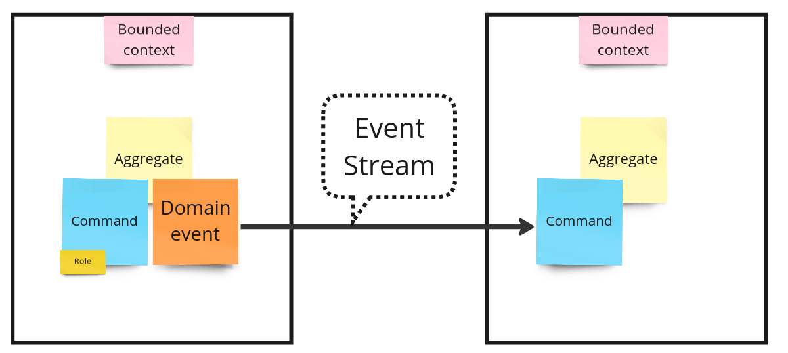
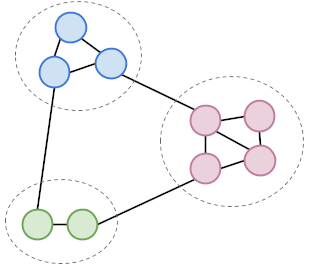

# Мотивация

> Логику предметной области можно реализовать таким образом, чтобы она вообще не зависела от инфраструктуры.

## Event Storming

Все заинтересованные стороны периодически собираются для построения модели предметной области, выделяют ограниченные контексты и фиксируют важные детали предметной области в категориях [Domain-driven design (DDD)](https://en.wikipedia.org/wiki/Domain-driven_design). В результате должна получиться диаграмма, понятная как разработчикам, так и заказчикам.



| Категория DDD              | Оригинальное название | Обозначение на диаграмме             |
|----------------------------|-----------------------|--------------------------------------|
| Ограниченный контекст      | Bounded context       | Рамка, розовый стикер с названием    |
| Событие предметной области | Domain event          | Оранжевый стикер                     |
| Команда (Действие)         | Command               | Синий стикер                         |
| Роль                       | Role                  | Маленький желтый стикер под командой |
| Сущность                   | Entity                | -                                    |
| Объекты-значение           | Value-object          | -                                    |
| Агрегат                    | Aggregate             | Светло-желтый стикер                 |
| Инвариант                  | Invariant             | -                                    |

> ___NOTE___:\
> Не все категории DDD обозначаются такой на диаграмме.

Очень важно разделить систему на контексты (bounded context), которые обладают:
- _Сильной внутренней связностью_ (high cohesion), т.е. фокусируются на конкретном аспекте предметной области.
- _Слабой внешней связанностью_ с другими контекстами (low coupling), т.е. события, происходящие в одном контексте слабо влияют на события, происходящие в другом контексте. 



## Инверсия зависимости 

Под зависимостью понимается буквально зависимость на уровне исходного кода. Если модуль `b.py` напрямую или транзитивно импортирует модуль `a.py`, то говорится, что `b.py` зависит от `a.py`.

```python
"""
File: a.py
"""

class A:
    def method(self) -> None:
        ...
```

```python
"""
File: b.py
"""

# noinspection PyUnresolvedReferences,PyPackageRequirements
from a import A  # `b.py` depends on `a.py`

class B:
    def __init__(self) -> None:
        self.a = A()
```

Такую зависимость можно инвертировать, определив интерфейс и поместив его в модуль `b.py`.

```python
"""
File: a.py
"""
# noinspection PyUnresolvedReferences,PyPackageRequirements
import b # `a.py` depends on `b.py`

class A(b.A):
    def method(self) -> None:
        ...
```

```python
"""
File: b.py
"""
from abc import ABC, abstractmethod

class A(ABC):
    @abstractmethod
    def method(self) -> None:
        pass

class B:
    def __init__(self, a: A) -> None:
        self.a = a
```

Теперь `a.py` зависит от `b.py`.

> ___NOTE___:\
> Таким образом можно инвертировать любую зависимость в коде, которым вы владеете

Инверсия зависимости трубет механизма внедрения зависимости. Некоторые зависимости можно внеднить в точке входа в программу или на этапе инициализации:

```python
"""
File: main.py
"""
# noinspection PyUnresolvedReferences,PyPackageRequirements
import a
# noinspection PyUnresolvedReferences,PyPackageRequirements
import b

def main() -> None:
    _ = b.B(a.A())

if __name__ == '__main__':
    main()
```

> ___NOTE___:\
> Точка входа в программу - не единственное место, где можно внедрять зависимости. 

## Объектно-ориентированное проектирование

Зафиксированные детали предметной области хорошо ложатся на объектно-ориентированный код:

| Категория DDD              | Оригинальное название | ООП в Python      |
|----------------------------|-----------------------|-------------------|
| Ограниченный контекст      | Bounded context       | Module / Package  |
| Событие предметной области | Domain event          | Interface Method  |
| Команда (Действие)         | Command               | Method            |
| Роль                       | Role                  | Class             |
| Сущность                   | Entity                | Class             |
| Объекты-значение           | Value-object          | Primitive / Class |
| Агрегат                    | Aggregate             | Class             |
| Инвариант                  | Invariant             | Exception         |

Вот пример кода на Python в этих терминах:

```python
# Module: bounded_context.py
from __future__ import annotations

from abc import ABC, abstractmethod
from enum import StrEnum


class EventListener(ABC):
    @abstractmethod
    def domain_event(self, aggregate: Aggregate) -> None:
        pass


class Role:
    def __init__(self, role_id: str) -> None:
        self.id = role_id

    def command(
        self,
        aggregate: Aggregate,
        entity: Entity,
        value_object: ValueObject,
        listener: EventListener,
    ) -> None:
        if aggregate.role_id == self.id:
            raise InvariantViolated
        return aggregate.command(entity, value_object, listener)


class Aggregate:
    def __init__(
        self,
        role_id: str,
        value_object: ValueObject | None = None,
        entity: Entity | None = None,
    ) -> None:
        self.role_id = role_id
        self.value_object = value_object
        self.entity = entity

    def command(
        self,
        entity: Entity,
        value_object: ValueObject,
        listener: EventListener,
    ) -> None:
        self.entity = entity
        self.value_object = value_object
        listener.domain_event(self)


class ValueObject(StrEnum):
    name = "value"


class Entity:
    def __init__(self, entity_id: str) -> None:
        self.id = entity_id


class InvariantViolated(Exception):
    pass
```

События (domain events) могут попасть в другой ограниченный контекст (bounded context) разными способами, например, через очередь сообщений (message queue). При этом желательно иметь некоторый уровень гарантии, что событие не потеряется и будет обработано ровно один раз. Это исключительно _технические детали_, о которых знают разработчики, но не эксперты предметной области.

_Интерфейс_ `EventListener` необходим для _инверсии зависимости_ таким образом, чтобы _инфраструктура_ зависила от предметной области, а не наоборот. Разумеется, необходим механизм внедрения такой зависимости. 

С точки зрения кода в ограниченном контексте (bounded context):
- Происходят некоторые события (domain events) 
- На происходящие события реагируют другие ограниченные контексты (bounded contexts)

При этом сокрыта информация как о реализации, так и о других контекстах:
- Синхронно или асинхронно будет происходить взаимодействие между контекстами (bounded contexts)? Интерфейс синхронный, а реализация может быть синхронной, многопоточной, асинхронной, или даже на гринлетах.
- Какой контекст (bounded context) будет реагировать на событие (domain event)? Будет ли вообще реагировать? Интерфейс определяет какое событие произошло, но скрывает реакцию на это событие.

> ___NOTE___:\
> Посмотрите другие примеры контекстов, которые не зависят от _инфраструктуры_ в [исходном коде](https://github.com/returnnullptr/event-outbox-example/tree/main/example/domain).

## Ссылки

- [Интеграция](https://github.com/returnnullptr/event-outbox/blob/main/docs/ru-RU/integration.md)
